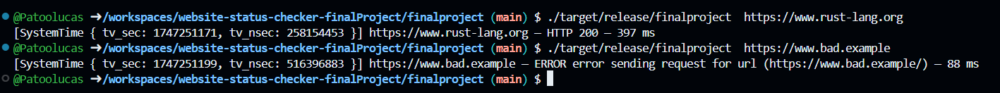

# Website Status Checker Final Project

# build
cargo build --release

# usage
website_checker [file sites.txt] [URL]
               [workers] [timeout] [retries]

# field names
url = original url
status = 200-599 "success" or error
rt_ms = total round-trip time in ms
ts = timestamp of completion

